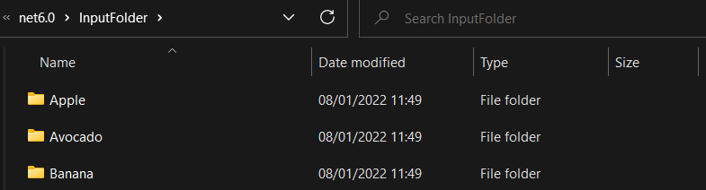
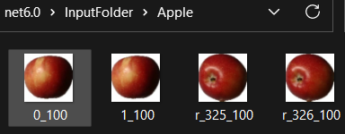
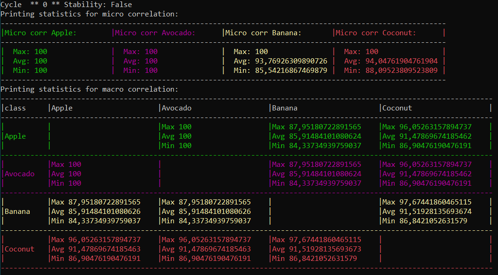
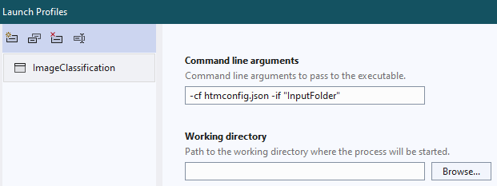

# NeocortexApi-Project **Image Classification**

This project is the implementaiton of the command line interfaca for the image classification based on the Hierarchical Temporal Memory (HTM) implemented in the [necortexapi](https://github.com/ddobric/neocortexapi) repository.

This project is a collected work of thesis [**htm imgclassification**](https://github.com/UniversityOfAppliedSciencesFrankfurt/thesis-htm-imgclassification-dasu) by Dasu Sai Durga Sundari and SoftwareEngineering(SE) project of the same name by Long Nguyen at the Frankfurt University of Applied Sciences.  

## How to use the classifier?

### 1 Prepare the program's directory:
 
 Before you start you need to prepare images that are required for the training. Images must be copied in the following folder structure along with the application and the config json:  

 
 
The imagesets are stored inside "InputFolder/".  

  

Each Imageset is stored inside a folder whose name is the set's label.  

  

 Sample input folder of the project can be found [here](ImageClassification/ImageClassification/InputFolder)  
 ### 2 Start the application by passing required command line arguments
 ~~~
 ImageClassification -if "InputFolder" -cf htmconfig.json
 ~~~
 -if   "Input Images folder path"  
 -cf   "json htm config file path"  
 
 **HTM Configuration**  
 HTM setting of the project can be inputted to the program by means of a .json file [htmconfig.json](ImageClassification/ImageClassification/htmconfig.json).  
 Multiple experiments can therefore be conducted via changes of parameters in the json file. 
 For a reference on what each parameter does, please refer to  on [neocortexapi](https://github.com/ddobric/neocortexapi) 
 
### 3 How it works

When started the application will load images and start the training process. The training process runs in following steps.

#### (1) Convert The Images to binary array via binarization**  
[The Binarization Library](https://github.com/daenetCorporation/imagebinarizer) was developed as an open source project at [Daenet](https://daenet.de/de/).  
the current implementation uses a color threshold of 200 for every color in a 8bit-RGB scale.  
The images with the same label must be stored in folder. The folder name is the images' label.   

#### (2) Learn spatial patterns stored in images with the Spatial Pooler(SP)
SP first iterates through all images until the stable state is entered.
SP iterate through all the images as it learns.

#### (3) Validation of SP Learning for different set of images
The last set of Sparse Density Representations (SDRs), the output of Spatial Pooler(SP) for each binarized image were saved for correlation validation.  
There are 2 types of correlation which are defined as follow:
1. *Micro Correlation*: Maximum/Average/Minimum correlation in similar bit percent of all images' SDRs which respect to each another in the same label.  
2. *Macro Correlation*: Maximum/Average/Minimum correlation in similar bit percent of all images' SDRs with images from 2 different labels.   
The results of the two correlation are printed in the command prompt when executing the code  

The algorithm for calculating correlation can be found [here](https://github.com/ddobric/neocortexapi/blob/7d05b61b919a82fd7f8028c63970dfbc7d78dd50/source/NeoCortexApi/Utility/MathHelpers.cs#L93)  
Result example:

  
The Images used was collected from [Fruit 360](https://github.com/Horea94/Fruit-Images-Dataset).  
## How to run the application in Visual Studio
Visual Studio can add arguments (args) parameter to run your code.  

This is done by changing the arguments command line arguments in Debug Properties Launch Profiles to 
~~~
-cf htmconfig1.json -if "InputFolder"
~~~
-cf add the option of the configuration file "htmconfig1.json"  
-if add the option of the training Input Folder "InputFolder/".  
This folder contains folders of images, where the folder names also act as the label for the images inside it.  

